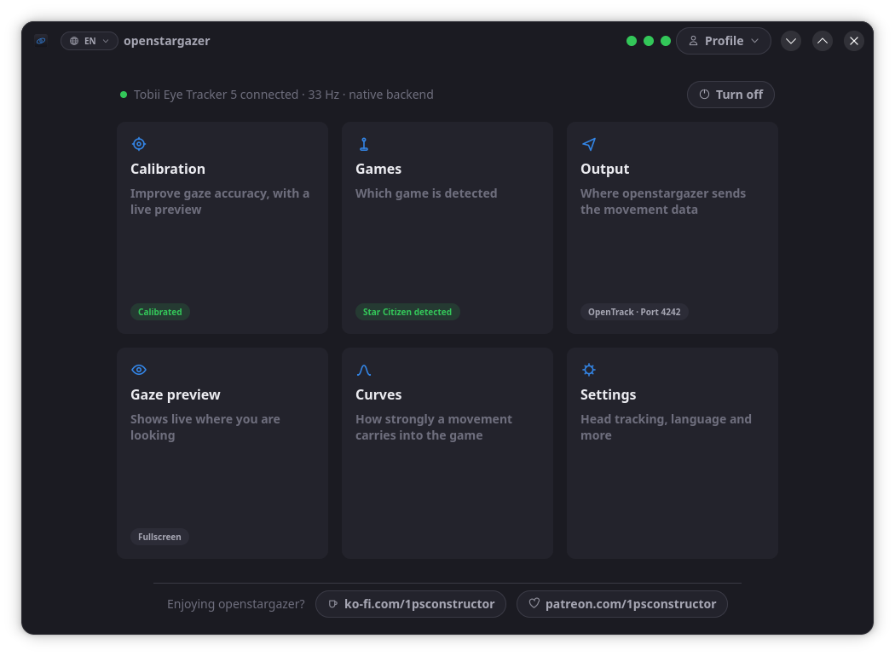

# openstargazer

[](https://github.com/1psconstructor/openstargazer/actions/workflows/ci.yml)
[](LICENSE)
[](https://www.python.org/)
[](https://ko-fi.com/1psconstructor)
[](https://patreon.com/1psconstructor)

Native Linux driver for the **Tobii Eye Tracker 5** with automatic Star Citizen /
LUG-Helper integration.

> **No Windows VM, no proprietary binaries.** openstargazer talks to the ET5
> directly over USB and bridges the data to OpenTrack.



---

## Quick Start

From a clone:

```bash
./scripts/install.sh              # 1× setup (backend, LUG detection, udev rules)
systemctl --user start openstargazer  # start the background daemon
osg-config                        # open GUI → "Star Citizen Setup" → done
```

Or in one line, without cloning first — `<tag>` is a released version from
[the tag list](https://github.com/1psconstructor/openstargazer/tags), currently `v0.5.0`:

```bash
curl -fsSL https://raw.githubusercontent.com/1psconstructor/openstargazer/v0.5.0/scripts/bootstrap.sh \
    | bash -s -- --ref v0.5.0
```

There is no default version on purpose. Pointing this at a branch would
install whatever the repository happened to contain at that second, and no
checksum can fix that. Add `--sha256 <hash>` to check the download against
a hash published with the release.

`install.sh` itself cannot be piped into a shell: it reads the translations
and other files from its own directory, and through a pipe there is no
directory to read them from. That is what `bootstrap.sh` is for — it
fetches a release and then runs the installer from it, normally.

Then: start Star Citizen → start OpenTrack → head tracking is active.

---

## Extended head tracking

The gaze stream carries **no head rotation**. That is measured, not
missing: across all 39 fields the ET5 reports, not one turns with the
head. So a default install gives you head **position**, **roll** and the
gaze point — four of the six axes.

Turn and tilt come from the device's own infrared camera, read alongside
the gaze stream and put through a neural network whose weights ship with
the project under GPL-3.0. They are trained from scratch on
`replicantface` (MIT-licensed synthetic faces) — no non-commercial
training data, no third-party download. The face crop comes from the gaze
stream's eye positions, not a separate localizer network. See
[docs/head-pose-model.md](docs/head-pose-model.md).

It is **off by default**, and turning it on is a question the setup asks
and a switch in the settings window. What it costs, so the switch is worth
what it says:

| | |
|---|---|
| Extra package | `onnxruntime` — `pip install 'openstargazer[camera]'` |
| Per picture | about 6 ms, a fifth of one core at 33 Hz |
| Pictures | read, measured, dropped. Nothing stored, nothing sent anywhere |
| Gaze stream | unaffected — measured at 33.1 fps with and without |

In `config.toml` it is `source` under `[input]`:

```toml
[input]
source = "et5_ttp_camera"    # six axes; "et5_native" for four
```

The daemon picks its source at start-up, so a change takes a restart:
`systemctl --user restart openstargazer`.

---

## Architecture

```
ET5 ──► osg-daemon ──► OpenTrack UDP:4242 ──► OpenTrack (Linux, Wine output) ──► Star Citizen
```

The daemon (`osg-daemon`) reads gaze and head-pose data from the Eye Tracker 5,
applies OneEuro filtering, and sends 6-DoF data as a 48-byte UDP packet to
OpenTrack on `localhost:4242`.

A GTK4/libadwaita GUI (`osg-config`) provides:
- Live gaze & head-pose preview
- Calibration (5- or 9-point)
- Per-axis Bezier curve editor
- Profile management (save, rename, delete)
- Service control (start/restart/stop/remove, autostart) and the
  OpenTrack UDP port, without editing `config.toml`
- System tray integration

---

## Input sources

| Source | Needs | Axes |
|---|---|---|
| `et5_native` (**default**) | nothing beyond `pyusb` | position, roll, gaze |
| `et5_ttp_camera` | `onnxruntime` (optional extra) | the same **plus yaw and pitch** |
| `et5_stream_engine` | Tobii's unofficial binaries, fetched by `install.sh` | six, via Tobii's own software |

The native path speaks USB directly, so there is no `tobiiusbserviced` and
nothing to download. `et5_ttp_camera` is the same path with the device's
camera read alongside it — see [Extended head tracking](#extended-head-tracking)
above.

`[device] backend` is the older name for this choice and still works:
`native` means `et5_native`, `stream-engine` means `et5_stream_engine`.
Switch per run with `osg-daemon --backend stream-engine`, or permanently
with `source` under `[input]` in `config.toml`.

---

## Requirements

### System packages (Arch / Manjaro)
```bash
sudo pacman -S python-gobject gtk4 libadwaita libayatana-appindicator \
               libusb usbutils opentrack
```

`install.sh` covers Arch, Fedora and Debian/Ubuntu.

### udev

The installer places `udev/70-openstargazer.rules` in `/etc/udev/rules.d/`.
**Unplug and replug the eye tracker afterwards** — the rule only applies to
devices connected after it was loaded.

---

## Language

All user-facing text lives in `openstargazer/locales/<code>.lang`, one
`key = value` per line. To add a language, copy `en.lang`, translate the
values, and select it:

```bash
OSG_LANG=de osg-setup      # or just set your system locale
```

**English, German, French, Italian and Spanish** ship with the project, all
five complete. Keys missing from a translation fall back to English
individually, so a partial translation is fine while it is being written.
Log messages stay English on purpose so bug reports remain readable.

The language can also be switched in the settings window — the globe in the
header, or the full list under Settings.

---

## In-game Settings (Star Citizen)

1. Open **COMMS, FOIP & HEAD TRACKING**
2. Set **Head Tracking Source** → `TrackIR`
3. **Start order**: Star Citizen first → then OpenTrack

---

## Configuration

`~/.config/openstargazer/config.toml` – auto-created on first run.

See [HANDBOOK.md](HANDBOOK.md) for the full reference, or
[HANDBUCH.md](HANDBUCH.md) for the German edition.

---

## Contributing

See [CONTRIBUTING.md](CONTRIBUTING.md).

---

## License

**GPL-3.0-or-later** – see [LICENSE](LICENSE).

Up to and including v0.2.2 this project was MIT-licensed, and those
releases stay MIT; a licence already given cannot be taken back. Everything
from v0.3.0 on is GPL-3.0-or-later. In practice: use it, change it, sell
it — but if you pass a changed version on to someone else, they get the
source under the same terms.
